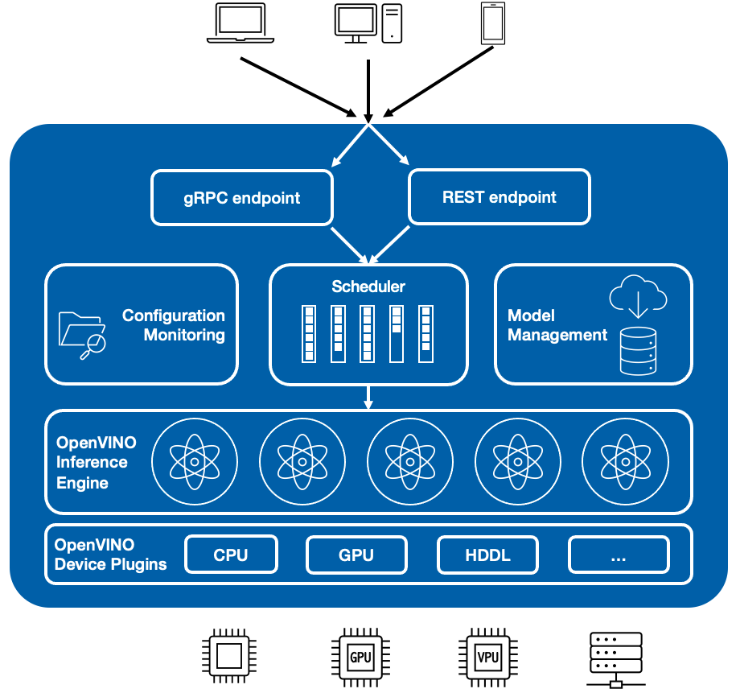

# Architecture Concept

OpenVINO&trade; Model Server is a C++ implementation of gRPC and RESTful API interfaces defined by Tensorflow serving.
In the backend it uses _Inference Engine libraries_ from OpenVINO&trade; toolkit, which speeds up the execution on CPU,
and enables it on AI accelerators like NCS, iGPU, HDDL, FPGA. 

gRPC code skeleton is created based on TensorFlow Serving core framework with tunned implementation of requests handling. 
Services are designed via set of C++ classes managing AI models in Intermediate Representation 
format. OpenVINO Inference Engine component executes the graphs operations.

**Figure 1: Docker Container (VM or Bare Metal Host)**

OpenVINO&trade; Model Server requires the models to be present in the local file system or they could be hosted 
remotely on object storage services. Both Google Cloud Storage and S3 compatible storage are supported. 

OpenVINO&trade; Model Server can be hosted on a bare metal server, virtual machine or inside a docker container. 
It is also suitable for landing in Kubernetes environment. 

The only two exposed network interfaces are gRPC and RESTful API, which currently _does not_ include authorization, 
authentication, or data encryption. Those functions are expected to be implemented outside of the model server 
(for example via Kubernetes* ingress or nginx forwarding proxy). 
